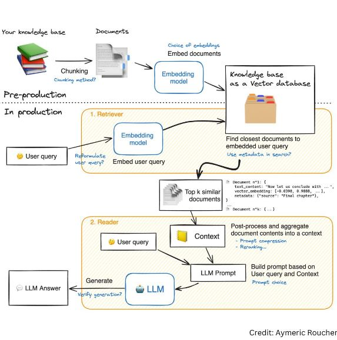

# RAG-based Question Answering System
Retrieval Augmented Generation-based LLM application with Gemini and Langchain

## Overview
This project implements a Question Answering (QA) system using Gemini 1.0 pro Large Language Model (LLM) based on the Retrieval-Augmented Generation (RAG) approach. RAG's distinguishing feature is its ability to integrate external knowledge sources seamlessly. By drawing from vast information repositories, RAG augments its understanding, enabling it to provide well-informed and contextually nuanced responses. The system allows users to upload a PDF document and ask questions related to the content of the document. It utilizes a Streamlit app for the user interface.

## Complete Retrieval Augmented Generation Process


## Features
- Upload PDF document to be used for question answering.
- Ask questions related to the content of the uploaded document.
- Implements the Retrieval-Augmented Generation (RAG) approach for improved answer generation.
- Utilizes a Gemini pro Large Language Model for generating answers.

## How to Use
1. Clone this repository to your local machine.
2. Create the .env file and add your google API key to access the Gemini-Pro open source model
   ```
   GOOGLE_API_KEY = "your_api_key"
   ```
3. Install the required dependencies by running:
    ```
    pip install -r requirements.txt
    ```
4. Run the application by executing:
    ```
    streamlit run app.py
    ```
5. Once the application is running, upload a PDF document using the file uploader widget.
6. Type your question related to the content of the uploaded PDF.
7. View the answer provided by the RAG application.

## Technologies Used
- Python
- Streamlit
- Gemini 1.0 Pro model
- Langchain
- NLP techniques

## Demo

